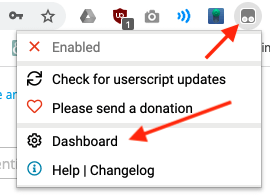

# Local Development with TamperMonkey

This TamperMonkey script compiles the .less files in a local Mura or Magento repository and previews the result on a production or staging server immediately without the need for a local database or working dev environment.

## 1. Install TamperMonkey extention in your browser

Available [TamperMonkey](https://www.tampermonkey.net/) extentions:
- [For Firefox](https://addons.mozilla.org/en-US/firefox/addon/tampermonkey/)
- [For Chrome](https://chrome.google.com/webstore/detail/tampermonkey/dhdgffkkebhmkfjojejmpbldmpobfkfo?hl=en)
- [For Microsoft Edge](https://www.microsoft.com/en-us/p/tampermonkey/9nblggh5162s?activetab=pivot:overviewtab)
- [For Safari](https://apps.apple.com/us/app/tampermonkey/id1482490089?mt=12)

## 2. Configure the script

Download the example "[tampermonkey.js](https://raw.githubusercontent.com/WoollyMittens/tampermonkey-local-dev/master/tampermonkey.js)" script from [this repository](https://github.com/WoollyMittens/tampermonkey-local-dev).

### Fill in the project information

In the top of the file edit the @name of your project and @match the domain of the site the script should affect.

```javascript
// ==UserScript==
// @name         PROJECT_NAME
// @namespace    http://tampermonkey.net/
// @version      0.3
// @description  Insert custom CSS and JS
// @author       maurice.vancreij@webqem.com
// @match        https://*.PROJECT_WEBSITE.com/*
// @grant        none
// ==/UserScript==
```

In this case the following domains would be affected: www.project_website.com, staging.project_website.com, preprod.project_website.com, etc.

### Find the local path of the repository

Turn on [MAMP](https://www.mamp.info/en/downloads/), [Docker](https://www.docker.com/), [Gulp-serve](https://www.npmjs.com/package/gulp-serve), or the built in [Apache](https://websitebeaver.com/set-up-localhost-on-macos-high-sierra-apache-mysql-and-php-7-with-sslhttps) on your Mac.

If the path to the stylesheet on your harddrive is:

    /Users/mauricevancreij/Sites/project-repository/theme/styles/styles.css

then the url will typicaly be something like:

    http://localhost/~mauricevancreij/Sites/project-repository/theme/styles.css

Or if you have configured the project in MAMP something like:

    http://project.local/theme/styles.css

Try variations of the URL out in your browser to find out the correct one.

### Fill in the local path

Edit the following constants in the "tampermonkey.js" to reflect your localhost:

```javascript
const localUrl = 'http://localhost/PATH_TO_THE_LOCAL_FILES/';
const stylesHref = 'css/styles.less';
const scriptSrc = 'js/scripts.js';
const removeThese = 'link[href*="existing.css"]';
```

It this case it would be:

```javascript
const localUrl = 'http://localhost/~mauricevancreij/Sites/project-repository/';
const stylesHref = 'theme/styles.css';
const scriptSrc = null;
const removeThese = null;
```

<sub>* Advanced: Additional javascript can also be loaded into the live site if the "scriptSrc" is filled in.</sub>

<sup>** More advanced: If existing stylesheets need to be removed first, fill in "const removeThese" to match them.</sup>

### Load the script into the browser extension

Open the TamperMonkey extension in your browser:



Go to the Dashboard and create a new project:


Paste and save your modified "tampermonkey.js" in the editor:


The new script will now appear as active in the list:


## 3. Preview your modifications

Open the live site in the browser:


Add new CSS to the local files:


Refresh the browser or press ~ to see you changes on the live site:


## Troubleshooting

If the browser refuses to load the new assets, it can sometimes help to add this [.htaccess](.htaccess) file to your localhost folder.
